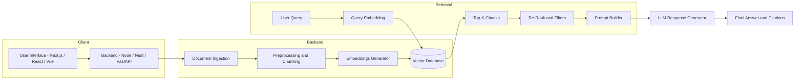
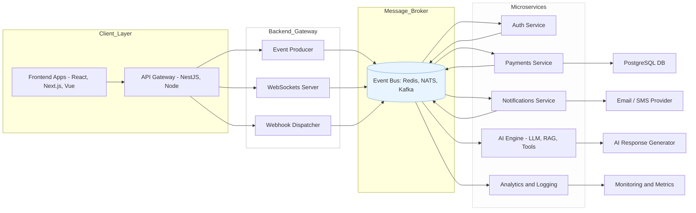

<!-- GitHub Profile README -->

  
   
  

---

### About Me

I am a **Full Stack Developer & AI Engineer** who builds scalable applications, intelligent systems, and production-ready features from the ground up.

- Skilled in **end-to-end development**: frontend → backend → infra → deployment  
- Expert in **React, Vue.js, Next.js, Node.js, Express, NestJS**  
- Strong in **sockets, webhooks & RESTful APIs**  
- Experienced in integrating **3rd-party platforms, APIs, and automation workflows**  
- Skilled with **PostgreSQL, SQL, MongoDB, and vector databases**  
- Delivered **MERN stack applications, MVPs, and full-scale AI integrations**  
- Build intelligent systems using **LLMs, RAG, agents, analytics, and retrieval pipelines**  

I mix **solid engineering** with **practical AI** to build real, production-ready solutions.

---

### Highlights

- Built **full-stack web apps, MVPs, dashboards & real-time systems**  
- Created **Node + NestJS APIs**, authentication systems, and microservices  
- Deep experience with **React, Vue.js, Next.js & modern component architectures**  
- Implemented **real-time sockets**, message broadcasting & event-driven flows  
- Integrated multiple **3rd-party services** (payments, storage, AI APIs, auth, DevOps tools)  
- Developed **RAG systems**, AI pipelines & vector-based search systems  
- Worked on **AI Interview Systems**, autonomous assistants & chat workflows  

---

### What I’m Currently Exploring

- Enhancing **AI-driven full-stack applications**  
- Building **event-driven backend systems with sockets + webhooks**  
- Working on **Agent-based architectures, custom tools & LLM observability**  
- Fine-tuning **Next.js + AI integrations**

---

### Tech Stack

#### **Full Stack Development**

  
  
  
  
  
  
  
  

#### **Databases**
`PostgreSQL` • `MongoDB` • `SQL` • `Mongoose` • `Prisma` • `Vector DBs (Pinecone, Chroma, FAISS)`

#### **Backend Architecture**
`Sockets` • `Webhooks` • `REST APIs` • `Microservices` • `Event-driven systems`

#### **AI & Machine Learning**

  
  
  
  
  

`RAG Pipelines` • `LLM Integration` • `Embedding Models` • `Fine-Tuning` • `Agents`

#### **MLOps & Deployment**

  
  
  

`CI/CD` • `Cloud Deployments` • `Containerized Architectures`

---

### Core Expertise

I blend **full-stack development** with **practical AI engineering** to deliver complete, scalable systems.

- Full-stack apps with **React/Next + Node/Nest**  
- Real-time apps using **WebSockets, listeners & pub/sub**  
- Secure APIs, auth flows, middleware & 3rd-party integrations  
- RAG systems with **vector search, embeddings & adaptive prompts**  
- Databases: SQL optimization, schemas, indexing, migrations  
- AI engineering: multimodal, conversational, retrieval, monitoring  
- System design: performance, scalability, infrastructure  

---

##  RAG Pipeline (Full-Stack + AI Engineering View)

## Event-Driven Architecture

  ---

## ✨ Let's Connect

Thanks for visiting my GitHub! I'm always excited to collaborate, share ideas, and build innovative solutions.  

- 💼 **Looking to collaborate?** Check out my projects and reach out via email.  
- 📬 **Contact Me:** [zaharehman788@gmail.com](mailto:zaharehman788@gmail.com)  
- 🌐 **LinkedIn:** [Zaha Rehman](https://www.linkedin.com/in/zaha-rehman/)  

---

  <!-- Waving Banner -->
  
   
  <!-- Animated Personal Motto -->
  

